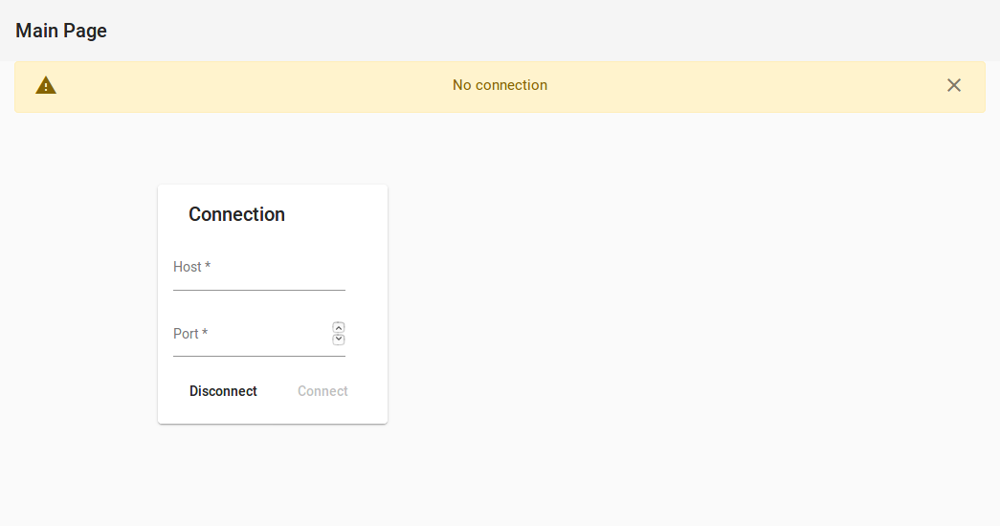

# FMS GUI Web

This project is a web based tool for the visualization and analysis of the FMS data.

## Getting Started

The application itself is split into two parts:
* Client - Provides the UI and the visualization tools
* Server - Provides a static FMS JSON File

### Prerequisites

What things you need to run the software:
* [Angular](https://angular.io/) (Client side)
* [NodeJS](https://nodejs.org/en/) (Server side)

### Style guide

Please stick to the style guide, which is provided by [Angular](https://angular.io/guide/styleguide)\
Another style guide, which is highly recommended, is the one offered by [ITNext](https://itnext.io/choosing-a-highly-scalable-folder-structure-in-angular-d987de65ec7)\
When creating folders, please use dashes (-) for separating the names \
E.g. fms-data

## How-To

### Start
To run a simple simulation, we need to run following commands:

***Client*** 
`npm run start`

***Server*** 
`npm run start`

This starts both, the client and the server.

The server currently runs on ws://localhost:9000 and the client on http://localhost:4200.
To change that, please change the environment.ts property file in both projects, client and server.

### Connect
Both projects started independently from each other and don't need to know that the other exists.
The client is able to run without the server, but doesn't do much without any data.
This is why we need to connect the client to the server by going to **Main** and enter the host and the port where the server is running.
E.g. in the default case the server is running on ws://localhost:9000, so we have to enter 
Host: localhost
Port: 9000

Before:

After:

### Use
From there, you can switch either to the flight or status window.

**Flight**

Has one visualization, the radar. The radar updates itself automatically, if it receives new values.
You can interact with the radar by either changing the values inside the control box (e.g. change the rotation or center value).
You can also directly interact with your mouse inside the radar.

By simply dragging the mouse inside the radar, you change the rotation value.
By pressing CTRL and dragging the mouse inside the radar, you can move the radar. 
By pressing CTRL and moving the mouse wheel, you can zoom in or out of the radar.
By dragging the mouse inside the time axis (lower part of the radar), you can select a given time period you want to be displayed.

For example:

**Status** 

Has two main views: The flags and the status matrix window.

*Flags*: Is a static view, where only the color of the attributes changes, when a new value is received. No direct interaction possible.

*Status Matrix*: You can interact with this view by first adding attributes you would like to be displayed in the matrix.
This is done by entering characters in the search field. It will automatically give you suggestions what attributes are available.
As soon as you have selected some attributes, the view updates itself whenever new values are received. With each new value,
a new column is added.

By hovering over a column, you can see the time of this received value.
You can move the selected attributes by clicking anywhere but the cross inside a list item to reorder the matrix.
Clicking on the cross removes the attribute from the list. 
By dragging the mouse inside the time axis (similarly to the radar), you can select a given time period you want to be displayed.

For example:

## Related projects
* Classic FMS GUI: [FMSGUI](https://github.com/SpaceTeam/FMSGUI)

## Authors

* **Khlebovitch Thomas** - [Th2mas](https://github.com/Th2mas/)

## License

Copyright © 2020 [SpaceTeam](https://github.com/SpaceTeam).

This project is [GNU General Public License v3.0](https://www.gnu.org/licenses/gpl-3.0.de.html) licensed.

## Acknowledgments

None yet
